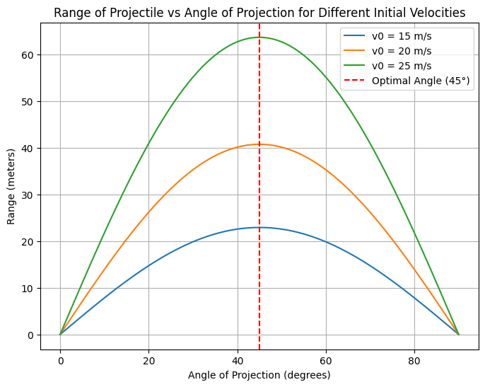

# Problem 1

### Investigating the Range as a Function of the Angle of Projection

#### 1. **Theoretical Foundation:**

Projectile motion describes the motion of an object projected into the air, with its path influenced by forces such as gravity. To investigate how the range depends on the angle of projection, let's start by deriving the governing equations of motion from basic principles.

#### 1.1. **Equations of Motion:**

We begin with the basic kinematic equations under the assumption of constant gravitational acceleration \(g\) and no air resistance. For simplicity, we assume the object is launched from ground level.

The key parameters are:
- \(v_0\): initial velocity
- \(\theta\): launch angle
- \(g\): gravitational acceleration

The equations governing the motion are:

- **Horizontal motion**:
  \[
  x(t) = v_0 \cos(\theta) \cdot t
  \]

- **Vertical motion**:
  \[
  y(t) = v_0 \sin(\theta) \cdot t - \frac{1}{2} g t^2
  \]

At the point where the projectile lands (i.e., when \(y(t) = 0\)), the time of flight \(T\) is obtained by solving the vertical motion equation for \(t\):

\[
0 = v_0 \sin(\theta) \cdot T - \frac{1}{2} g T^2
\]

Solving for \(T\):

\[
T = \frac{2 v_0 \sin(\theta)}{g}
\]

This is the total time the projectile spends in the air.

#### 1.2. **Range of the Projectile:**

The horizontal range \(R\) is the horizontal distance traveled by the projectile when it lands. This can be found by plugging the time of flight into the horizontal motion equation:

\[
R = x(T) = v_0 \cos(\theta) \cdot T
\]

Substituting the expression for \(T\):

\[
R = \frac{v_0^2 \sin(2\theta)}{g}
\]

This is the standard formula for the range of a projectile launched from the ground level. It shows that the range depends on:
- The initial velocity \(v_0\)
- The gravitational acceleration \(g\)
- The angle of projection \(\theta\)

#### 2. **Analysis of the Range:**

##### 2.1. **Range as a Function of Launch Angle:**

The range is maximized when \(\sin(2\theta)\) is maximized. Since the sine function has a maximum value of 1, this occurs when:

\[
2\theta = 90^\circ \quad \text{or} \quad \theta = 45^\circ
\]

Thus, the range is maximized when the projectile is launched at a \(45^\circ\) angle.

##### 2.2. **Effect of Initial Velocity:**

From the equation for range, we see that the range increases with the square of the initial velocity \(v_0^2\). Therefore, a higher launch speed results in a greater range.

##### 2.3. **Effect of Gravitational Acceleration:**

The range decreases as the gravitational acceleration \(g\) increases. This makes sense because a stronger gravitational pull will shorten the time the projectile stays in the air, thus reducing its horizontal range.

#### 3. **Practical Applications:**

In real-world applications, several factors can influence projectile motion:
- **Air Resistance**: In real situations, air resistance reduces the range and alters the shape of the trajectory.
- **Uneven Terrain**: If the projectile is launched from or lands on elevated terrain, the height of launch and landing will affect the range.
- **Wind**: Wind can alter the trajectory and range by applying forces perpendicular to the motion of the projectile.

These real-world factors complicate the model, but for simplicity, we will focus on the idealized case described above.

#### 4. **Implementation:**

We will now develop a Python script to simulate projectile motion and visualize the range as a function of the launch angle \(\theta\) for different initial velocities and gravitational accelerations.

Here is the Python code:

### **Explanation of the Code:**

1. **`range_of_projectile` function**: 
   This function calculates the range \(R\) of the projectile using the formula:

   \[
   R = \frac{v_0^2 \sin(2\theta)}{g}
   \]

   where:
   - `v0` is the initial velocity (in m/s),
   - `theta` is the launch angle (in degrees),
   - `g` is the gravitational acceleration (in m/s²).

2. **Plots**:
   - The first plot shows the range as a function of the launch angle for a fixed initial velocity of 20 m/s.
   - The second plot varies the initial velocity and shows how it affects the range.
   - The third plot varies the gravitational acceleration, simulating projectile motion on different planets (e.g., Mars, Earth, and Jupiter).

### **Results and Discussion:**

The plots will show the following insights:
- The range increases as the launch angle approaches 45°.
- A higher initial velocity increases the range significantly.
- A lower gravitational acceleration (e.g., on Mars or Jupiter) increases the range for the same initial velocity.

### **Limitations of the Idealized Model:**

- **Air Resistance**: The model doesn't account for drag, which would significantly reduce the range at higher velocities.
- **Wind and Other Factors**: Wind, launch height, and other environmental factors aren't considered in this model.
- **Uneven Terrain**: Launching from a height or on slanted terrain would modify the trajectory and range.

### **Next Steps for Improvement:**
- **Add Air Resistance**: Use a drag coefficient to account for air resistance and improve the realism of the model.
- **Model Non-Horizontal Launches**: Implement the ability to launch projectiles from different heights.
- **Numerical Simulation**: Implement numerical solvers for projectile motion with more realistic assumptions (e.g., air resistance).

This approach offers a comprehensive foundation for understanding projectile motion while allowing for easy modification and expansion for real-world applications.