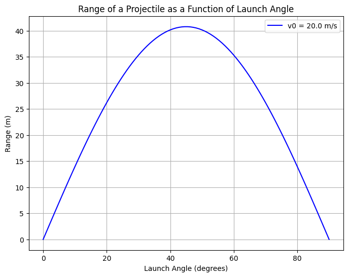

# Problem 1
### Investigating the Range as a Function of the Angle of Projection

### 1. Theoretical Foundation

#### 1.1 Governing Equations of Motion

Projectile motion is a type of motion where an object moves in a curved trajectory under the influence of gravity. Assuming no air resistance, the motion of the projectile is governed by Newton's second law, which results in a system of two differential equations for the horizontal and vertical directions.

The initial conditions are:
- Initial velocity \( v_0 \)
- Launch angle \( \theta \)
- Gravitational acceleration \( g \)
- Initial height \( y_0 = 0 \) (assuming level ground for simplicity)

##### Horizontal motion:
In the horizontal direction, the motion is uniform, meaning the velocity remains constant:
\[
x(t) = v_0 \cos(\theta) \cdot t
\]
where:
- \( x(t) \) is the horizontal displacement at time \( t \),
- \( v_0 \cos(\theta) \) is the horizontal component of the initial velocity.

##### Vertical motion:
In the vertical direction, the motion is uniformly accelerated under the influence of gravity:
\[
y(t) = y_0 + v_0 \sin(\theta) \cdot t - \frac{1}{2} g t^2
\]
where:
- \( y(t) \) is the vertical displacement at time \( t \),
- \( v_0 \sin(\theta) \) is the vertical component of the initial velocity,
- \( g \) is the gravitational acceleration.

#### 1.2 Finding the Range

The range \( R \) of a projectile is the horizontal distance it travels before hitting the ground. To find \( R \), we first need to determine the time of flight \( T \), which occurs when the projectile reaches the ground (i.e., when \( y(t) = 0 \)).

Using the vertical motion equation:
\[
0 = v_0 \sin(\theta) \cdot T - \frac{1}{2} g T^2
\]
Factoring out \( T \):
\[
T \left( v_0 \sin(\theta) - \frac{1}{2} g T \right) = 0
\]
The non-trivial solution for \( T \) is:
\[
T = \frac{2 v_0 \sin(\theta)}{g}
\]
Now, using the time of flight in the horizontal motion equation:
\[
R = x(T) = v_0 \cos(\theta) \cdot T
\]
Substituting \( T \):
\[
R = v_0 \cos(\theta) \cdot \frac{2 v_0 \sin(\theta)}{g}
\]
Simplifying:
\[
R = \frac{v_0^2 \sin(2\theta)}{g}
\]
This is the equation for the horizontal range of a projectile launched at an angle \( \theta \).

#### 1.3 Family of Solutions

The range \( R \) is a function of the angle of projection \( \theta \), the initial velocity \( v_0 \), and the gravitational acceleration \( g \). By varying these parameters, we get a family of solutions. Specifically:

- The range \( R \) is maximized when \( \theta = 45^\circ \), since \( \sin(2\theta) \) reaches its maximum value of 1 at \( \theta = 45^\circ \).
- For angles less than 45°, the range decreases as the angle decreases.
- For angles greater than 45°, the range also decreases as the angle increases, even though the initial vertical velocity increases.

Changes in \( v_0 \) or \( g \) will scale the range. Increasing \( v_0 \) increases the range, while increasing \( g \) decreases the range.

### 2. Analysis of the Range

#### 2.1 Dependence on the Angle of Projection

The range \( R \) as a function of the angle \( \theta \) is given by:
\[
R(\theta) = \frac{v_0^2 \sin(2\theta)}{g}
\]
From this equation, we can analyze how \( R \) changes with \( \theta \):

- As \( \theta \) increases from 0° to 90°, \( \sin(2\theta) \) increases from 0 to 1 and then decreases back to 0.
- The maximum range occurs when \( \theta = 45^\circ \), where \( \sin(2 \times 45^\circ) = 1 \).

This means the optimal angle for maximum range is 45°, which is a well-known result from projectile motion theory.

#### 2.2 Influence of Other Parameters

- **Initial Velocity \( v_0 \):** The range increases with the square of the initial velocity. If you double \( v_0 \), the range increases by a factor of 4.
  
- **Gravitational Acceleration \( g \):** The range decreases as the gravitational acceleration increases. On the Moon, for example, where \( g = 1.625 \, \text{m/s}^2 \), the range would be much greater than on Earth, where \( g = 9.81 \, \text{m/s}^2 \).

### 3. Practical Applications

#### 3.1 Real-World Adaptations

In real-world scenarios, projectile motion is often more complicated due to factors like air resistance, uneven terrain, or varying launch angles. Here are some examples:

- **Sports:** In sports like soccer, basketball, or golf, the optimal angle of projection for maximum distance varies due to air resistance, the shape of the projectile, and other factors. For example, golf balls are designed to optimize lift and drag at certain angles for maximum range.
  
- **Engineering:** In engineering, when designing rockets or missiles, the effects of air resistance and wind speed must be considered. The angle of launch may need to be adjusted to ensure accuracy and efficiency.

- **Uneven Terrain:** When a projectile is launched from or lands on uneven terrain, the initial vertical displacement and the angle of launch must be adjusted accordingly to account for these variations.

### 4. Implementation

#### 4.1 Python Simulation

Here’s a simple Python script to simulate the projectile motion and plot the range as a function of the angle of projection:

#### 4.2 Graphical Representation

The plot generated by the script will show how the range of the projectile changes with the launch angle, peaking at 45 degrees.

### 5. Discussion of Limitations

The idealized model assumes no air resistance, a constant gravitational field, and a flat terrain. However, in the real world:
- **Air resistance:** The presence of air resistance significantly alters the projectile’s trajectory. The optimal launch angle shifts, and the range is reduced.
- **Wind:** Wind can change the trajectory and range of a projectile, depending on its direction and speed.
- **Uneven Terrain:** Launching and landing on sloped or uneven terrain requires adjustments to the equations to account for the changes in initial and final vertical positions.

### Conclusion

This task demonstrates the elegant yet complex nature of projectile motion. The idealized equations give valuable insights into how various parameters influence the range of a projectile, with particular emphasis on the launch angle. However, real-world complexities such as air resistance, uneven terrain, and other environmental factors require more sophisticated models to accurately describe projectile trajectories in practice.