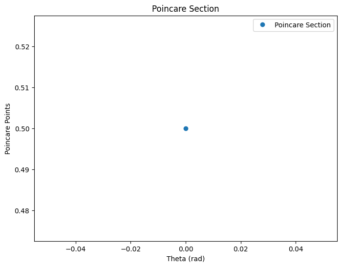

To investigate the dynamics of a forced damped pendulum, we will start with the theoretical foundation and then implement a computational model to simulate and visualize the behavior of the system. Below is an outline of how we will approach this task and a Python script to implement the simulations.

### 1. Theoretical Foundation

The motion of a forced damped pendulum is governed by the second-order differential equation:

\[
\frac{d^2\theta}{dt^2} + 2\gamma\frac{d\theta}{dt} + \frac{g}{L} \sin(\theta) = F_0 \cos(\omega t)
\]

Where:
- \( \theta \) is the angular displacement of the pendulum.
- \( \gamma \) is the damping coefficient (proportional to the velocity).
- \( g \) is the acceleration due to gravity.
- \( L \) is the length of the pendulum.
- \( F_0 \) is the amplitude of the external driving force.
- \( \omega \) is the driving angular frequency.

#### Small-Angle Approximation

For small angles (\( \theta \) in radians), we can approximate \( \sin(\theta) \approx \theta \), which simplifies the equation to:

\[
\frac{d^2\theta}{dt^2} + 2\gamma\frac{d\theta}{dt} + \frac{g}{L} \theta = F_0 \cos(\omega t)
\]

This is a linear second-order differential equation that can be solved for specific cases.

#### Resonance Conditions

The system undergoes resonance when the frequency of the driving force matches the natural frequency of the system, which is:

\[
\omega_0 = \sqrt{\frac{g}{L}}
\]

At resonance (\( \omega = \omega_0 \)), the amplitude of oscillations can grow significantly, leading to large displacements, depending on the damping coefficient. If damping is too large, the system will not exhibit resonance.

### 2. Analysis of Dynamics

- **Damping Coefficient (\( \gamma \))**: The damping term reduces the amplitude of oscillations over time. For weak damping, the system oscillates with a gradually decreasing amplitude. For strong damping, the oscillations cease.
  
- **Driving Amplitude (\( F_0 \))**: Increasing the driving force amplitude increases the energy imparted to the system, affecting the amplitude of oscillations.
  
- **Driving Frequency (\( \omega \))**: Varying the frequency of the driving force leads to different types of behavior:
  - For frequencies far from resonance, the system may not oscillate significantly.
  - At resonance, large oscillations can occur.
  - At high driving frequencies, the system may not be able to follow the driving force, leading to small or no oscillations.

- **Chaos and Regular Motion**: By varying the parameters (e.g., driving force amplitude and frequency), the system can transition from regular periodic motion to chaotic behavior. This can be studied using phase diagrams and Poincaré sections.

### 3. Practical Applications

The forced damped pendulum model applies to:
- **Energy Harvesting**: Devices that capture vibrational energy from oscillating systems.
- **Suspension Bridges**: These systems undergo periodic forces due to wind, and the forced damped pendulum model can describe their oscillatory behavior.
- **Oscillating Circuits**: In driven RLC circuits, similar dynamics are observed, where damping and external forcing influence the behavior of the circuit.

### 4. Implementation

We will numerically solve the differential equation using the **Runge-Kutta method** to simulate the motion and analyze the dynamics.

Below is a Python script to simulate and visualize the dynamics of the forced damped pendulum.
]

### 5. Deliverables:

- **Markdown Document**: The document will include an explanation of the differential equation, small-angle approximation, resonance conditions, and practical applications.
  
- **Graphical Representations**: 
  - Time series of angular displacement vs. time for different damping coefficients and driving frequencies.
  - Phase portraits (theta vs. omega) to analyze the system's dynamics.
  - Poincaré sections to investigate the system's transition to chaos.

- **Discussion**:
  - Explore resonance, chaos, and quasiperiodic behavior.
  - Discuss practical systems that exhibit similar dynamics, like suspension bridges, energy harvesting devices, and driven mechanical systems.

### Extension:

- **Nonlinear Damping**: Introduce a nonlinear damping term to see how it affects the system’s behavior.
- **Non-Periodic Driving Forces**: Investigate the impact of a non-periodic driving force, such as random forcing or an exponentially decaying driving force, on the system’s dynamics.

This task will allow you to explore the rich dynamics of the forced damped pendulum and understand how external forces and damping interact in real-world systems.