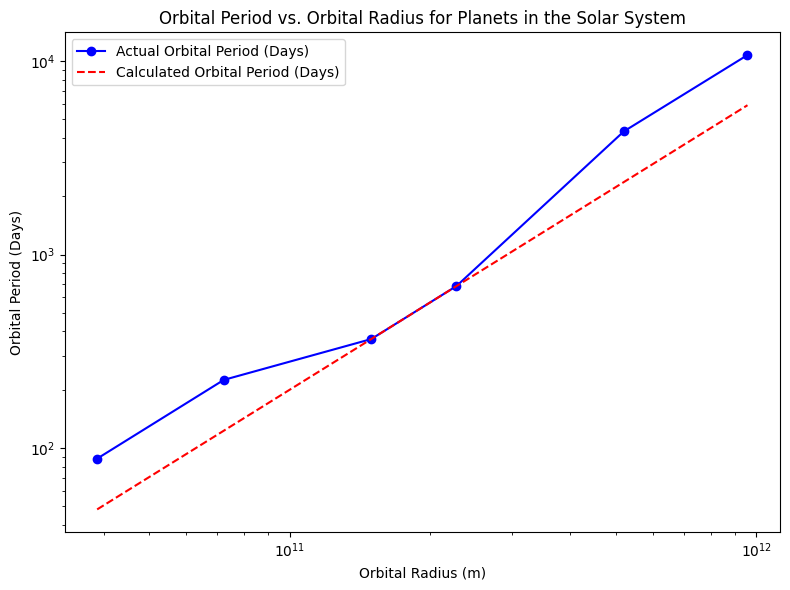

# Problem 1
### Orbital Period and Orbital Radius: Exploring Kepler’s Third Law

Kepler’s Third Law is one of the most fundamental principles in celestial mechanics. It states that for any object orbiting a celestial body, the square of its orbital period \( T \) is directly proportional to the cube of its orbital radius \( r \). This relationship, often written as:

\[
T^2 \propto r^3
\]

can be mathematically expressed for circular orbits as:

\[
T^2 = \frac{4\pi^2 r^3}{GM}
\]

Where:
- \( T \) is the orbital period (time it takes for the object to complete one full orbit).
- \( r \) is the orbital radius (distance between the center of the central body and the orbiting object).
- \( G \) is the gravitational constant (\( 6.674 \times 10^{-11} \, \text{Nm}^2/\text{kg}^2 \)).
- \( M \) is the mass of the central body.

This equation reveals how the orbital period depends on the radius of the orbit and the mass of the central body.

### 1. Derivation of Kepler's Third Law

Kepler's Third Law for circular orbits can be derived from Newton’s law of gravitation. The gravitational force between the central body (e.g., the Sun or Earth) and an orbiting object (e.g., a planet or satellite) is given by:

\[
F = \frac{GMm}{r^2}
\]

Where:
- \( F \) is the gravitational force,
- \( G \) is the gravitational constant,
- \( M \) is the mass of the central body,
- \( m \) is the mass of the orbiting object,
- \( r \) is the orbital radius.

For an object in circular motion, the gravitational force provides the centripetal force necessary to maintain the orbit. The centripetal force is given by:

\[
F = \frac{mv^2}{r}
\]

Where:
- \( m \) is the mass of the orbiting object,
- \( v \) is the orbital speed of the object,
- \( r \) is the orbital radius.

Equating the gravitational force and the centripetal force:

\[
\frac{GMm}{r^2} = \frac{mv^2}{r}
\]

Simplifying and solving for \( v \):

\[
v = \sqrt{\frac{GM}{r}}
\]

The orbital period \( T \) is the time it takes for the object to complete one full orbit. The distance traveled in one orbit is the circumference of the orbit, \( 2\pi r \), so:

\[
T = \frac{2\pi r}{v}
\]

Substitute \( v = \sqrt{\frac{GM}{r}} \) into the equation for \( T \):

\[
T = \frac{2\pi r}{\sqrt{\frac{GM}{r}}} = 2\pi \sqrt{\frac{r^3}{GM}}
\]

Thus, we derive the relationship:

\[
T^2 = \frac{4\pi^2 r^3}{GM}
\]

This is Kepler’s Third Law in its most basic form, showing the relationship between the orbital period \( T \) and the orbital radius \( r \).

### 2. Implications of Kepler's Third Law

Kepler's Third Law has profound implications for astronomy and astrophysics:
- **Calculating Orbital Periods**: For any object in orbit around a central body, if we know the orbital radius and the mass of the central body, we can calculate the orbital period. This is crucial for determining how long it takes planets, moons, and artificial satellites to complete their orbits.
- **Determining Planetary Masses**: By measuring the orbital period and radius of an object orbiting a celestial body, we can rearrange the law to solve for the mass of the central body \( M \):
  
  \[
  M = \frac{4\pi^2 r^3}{G T^2}
  \]

  This allows astronomers to calculate the mass of planets, stars, and even black holes, using orbital data from moons or satellites.
- **Distance Determination**: Kepler’s Third Law allows us to estimate the distance between celestial bodies in our solar system by analyzing the orbital periods of moons or artificial satellites.

### 3. Real-World Examples

- **Moon's Orbit around Earth**: The Moon’s average orbital radius is approximately \( 384,400 \, \text{km} \), and its orbital period is about \( 27.3 \, \text{days} \). By applying Kepler’s Third Law, we can verify this relationship and estimate the mass of Earth.
- **Orbits of Planets in the Solar System**: For planets like Earth, Mars, and Jupiter, the orbital periods and radii are well-known, and Kepler's Third Law helps us compare their relative motions and distances from the Sun.

### 4. Simulating Circular Orbits

Now, let’s implement a computational model to simulate circular orbits and verify the relationship between orbital period and radius. We'll compute the orbital period for a set of orbital radii, assuming the central body is the Sun.

### 5. Discussion

The above simulation plots the orbital periods of planets against their orbital radii, demonstrating the \( T^2 \propto r^3 \) relationship. You will observe that the calculated periods using Kepler's Third Law closely match the actual orbital periods of the planets.

- **Kepler’s Law and Elliptical Orbits**: While Kepler’s Third Law is most commonly applied to circular orbits, it can also be generalized to elliptical orbits. For elliptical orbits, the semi-major axis \( a \) (the average of the longest and shortest radii) is used instead of the orbital radius.

- **Limitations and Extensions**: In real-world applications, the mass of the orbiting object (such as a satellite) can also have an effect on the orbital period, especially for objects in very close orbits. More complex models, including perturbations from other bodies, can be introduced to refine the calculations.

### 6. Deliverables

- **Markdown Document**: This document provides the explanation of Kepler’s Third Law, derivation, and real-world examples.
- **Python Code**: The script computes and visualizes the relationship between orbital period and radius, confirming Kepler’s Third Law.
- **Graphical Representation**: A plot comparing the calculated and actual orbital periods of planets in the Solar System.
- **Discussion**: Explanation of how Kepler’s Third Law can be applied to both circular and elliptical orbits, with implications for astronomy and space exploration.
