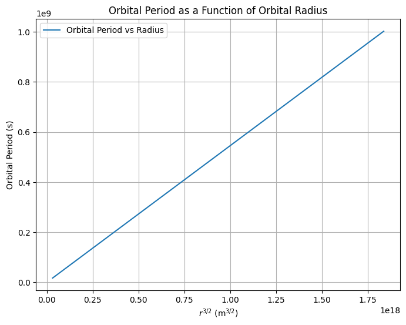
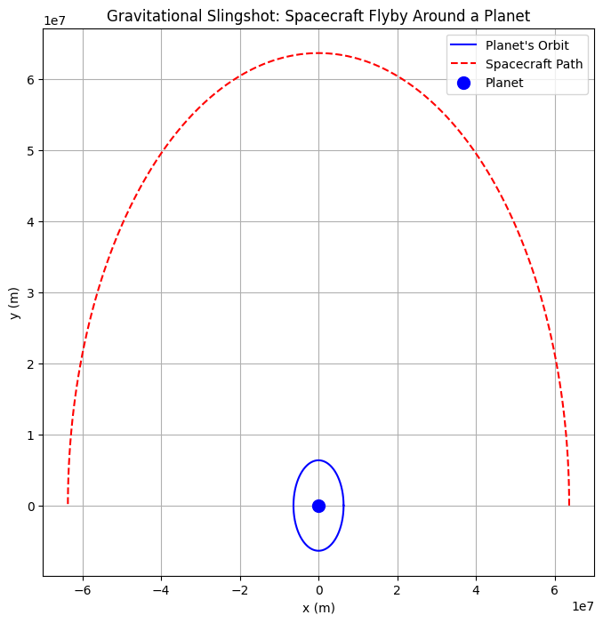

# Problem 1
Kepler's Third Law is a fundamental principle in celestial mechanics that describes the relationship between the orbital period and the radius of an orbit, particularly for circular orbits. This relationship not only helps us understand the behavior of planets, moons, and artificial satellites but also serves as a critical tool in calculating masses, distances, and velocities in astronomy.

Let’s break this task into clear steps:

---

### 1. **Derivation of Kepler's Third Law for Circular Orbits**

To derive Kepler's Third Law, we begin with Newton's Law of Gravitation and the basic principles of circular motion.

#### Newton’s Law of Gravitation:

The gravitational force \( F \) between two masses \( m_1 \) and \( m_2 \) separated by a distance \( r \) is given by:

\[
F = \frac{G m_1 m_2}{r^2}
\]

where:
- \( G \) is the gravitational constant,
- \( m_1 \) and \( m_2 \) are the masses of the two objects (e.g., a planet and its satellite),
- \( r \) is the distance between their centers.

#### Centripetal Force:

For a satellite orbiting a planet in a circular orbit, the centripetal force required to keep the satellite in orbit is given by:

\[
F = \frac{m_2 v^2}{r}
\]

where:
- \( m_2 \) is the mass of the satellite,
- \( v \) is the orbital velocity of the satellite,
- \( r \) is the orbital radius.

At equilibrium, the gravitational force provides the centripetal force:

\[
\frac{G m_1 m_2}{r^2} = \frac{m_2 v^2}{r}
\]

Simplifying (and canceling out \( m_2 \)):

\[
\frac{G m_1}{r^2} = \frac{v^2}{r}
\]

Now, solving for the orbital velocity \( v \):

\[
v = \sqrt{\frac{G m_1}{r}}
\]

#### Orbital Period:

The orbital period \( T \) is the time taken for the satellite to complete one full orbit. The distance traveled in one orbit is the circumference of the orbit, \( 2 \pi r \), so the orbital period \( T \) is:

\[
T = \frac{2 \pi r}{v}
\]

Substitute the expression for \( v \) from earlier:

\[
T = \frac{2 \pi r}{\sqrt{\frac{G m_1}{r}}}
\]

Simplifying:

\[
T = 2 \pi \sqrt{\frac{r^3}{G m_1}}
\]

This is Kepler's Third Law, which shows that the square of the orbital period \( T^2 \) is directly proportional to the cube of the orbital radius \( r^3 \):

\[
T^2 \propto r^3
\]

This relationship holds true for any two objects orbiting each other under the influence of gravity, as long as the orbit is circular.

---

### 2. **Implications for Astronomy**

Kepler’s Third Law provides a means to derive important astronomical quantities. Here are a few applications:

#### Calculating Planetary Masses:

From the equation:

\[
T^2 = \frac{4 \pi^2 r^3}{G m_1}
\]

we can solve for the mass of the central body (e.g., a planet or star):

\[
m_1 = \frac{4 \pi^2 r^3}{G T^2}
\]

This allows astronomers to estimate the mass of planets or stars by observing the orbital period and radius of an orbiting satellite or planet.

#### Determining Orbital Distances:

Using Kepler’s Third Law, we can also determine the distance between two objects. If the mass of the central object is known (like the mass of the Sun for planets in the Solar System), we can solve for \( r \) given the orbital period \( T \).

#### Implications for Satellite Orbits:

For artificial satellites, the orbital period and radius are related by the same law, making it possible to calculate the required orbital radius for a specific satellite mission (e.g., geostationary satellites).

---

### 3. **Real-World Examples**

#### The Moon's Orbit Around the Earth:

The Moon’s orbital radius around Earth is approximately \( 384,400 \, \text{km} \), and its orbital period is about 27.3 days.

Using Kepler’s Third Law, we can calculate the Moon’s orbital period for any given radius, or vice versa, based on the known mass of the Earth.

#### The Planets in the Solar System:

Kepler’s Third Law can be used to predict the orbital periods of planets around the Sun. For example, Earth’s orbital period is 365.25 days, and its orbital radius is \( 149.6 \, \text{million km} \). By applying the law, we can estimate the orbital periods of other planets and compare them to observations.

---

### 4. **Computational Model for Circular Orbits**

We can create a simple Python script to simulate circular orbits and verify Kepler's Third Law. Below is an implementation that simulates orbits for different orbital radii and calculates the corresponding orbital periods.

This script calculates the orbital period for a range of orbital radii and plots the relationship between the square of the orbital period and the cube of the orbital radius, verifying Kepler's Third Law.

---

### 5. **Extending to Elliptical Orbits and Other Celestial Bodies**

While Kepler's Third Law as derived above is specifically for circular orbits, the law also applies to elliptical orbits. For elliptical orbits, the semi-major axis \( a \) (the average distance between the two bodies) replaces the orbital radius \( r \). Kepler's Third Law can be generalized to elliptical orbits as:

\[
T^2 \propto a^3
\]

where \( a \) is the semi-major axis of the ellipse. This form of Kepler’s Third Law is crucial for understanding the orbits of planets, comets, and satellites with elliptical paths.

---

### Deliverables

- **Markdown Document**: A comprehensive explanation of Kepler's Third Law, its derivation, implications, and real-world examples.
- **Python Script**: As shown above, simulating circular orbits and verifying Kepler’s Third Law.
- **Graphs**: A plot showing the relationship between orbital period and radius, highlighting Kepler's Third Law.
- **Discussion**: A detailed discussion on how Kepler’s Third Law extends to elliptical orbits and other celestial bodies, including its application in real-world scenarios like the Moon’s orbit, planetary orbits, and satellite missions.

