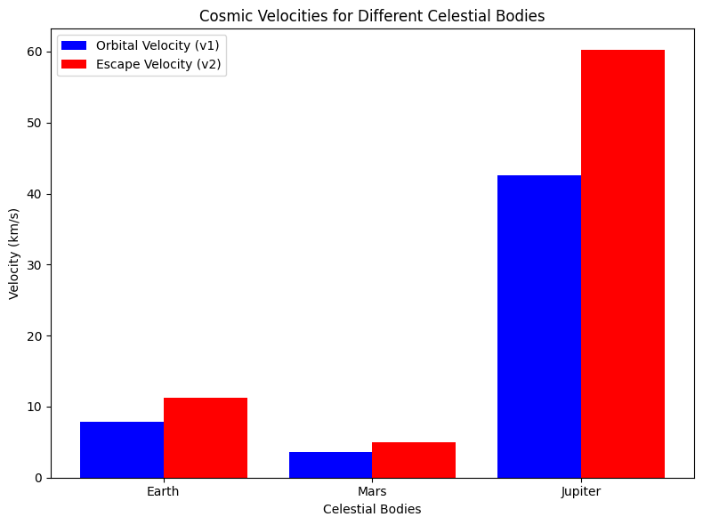

# Problem 2
The concept of escape velocity and the three cosmic velocities—first, second, and third—are fundamental in understanding the dynamics of objects in space. These velocities determine the thresholds for a spacecraft or object to achieve different types of motion in a gravitational field. Here's how we can approach this task, including the theoretical foundations, calculations, and visualizations.

### 1. Defining the Cosmic Velocities

**First Cosmic Velocity**: The first cosmic velocity is the speed required for an object to enter orbit around a celestial body without any further propulsion. This is the orbital velocity at which an object in a circular orbit has a centrifugal force equal to the gravitational force pulling it towards the body.

\[
v_1 = \sqrt{\frac{GM}{R}}
\]

Where:
- \( v_1 \) is the first cosmic velocity (orbital velocity).
- \( G \) is the gravitational constant (\(6.674 \times 10^{-11} \, \text{Nm}^2/\text{kg}^2\)).
- \( M \) is the mass of the celestial body.
- \( R \) is the distance from the center of the celestial body to the object.

**Second Cosmic Velocity (Escape Velocity)**: The second cosmic velocity is the speed required for an object to escape the gravitational influence of the celestial body completely. This is the minimum velocity needed for an object to break free from the body’s gravitational pull without any further propulsion.

\[
v_2 = \sqrt{\frac{2GM}{R}}
\]

Where:
- \( v_2 \) is the second cosmic velocity (escape velocity).
- \( G \) is the gravitational constant.
- \( M \) is the mass of the celestial body.
- \( R \) is the distance from the center of the celestial body to the object.

**Third Cosmic Velocity**: The third cosmic velocity is the velocity required to escape the gravitational influence of the Sun (or any star) and travel into interstellar space. This velocity takes into account the gravitational pull of the Sun and the motion of the object at the Earth's orbit (approximately).

\[
v_3 = \sqrt{\frac{3GM_{\text{sun}}}{R_{\text{Earth}}}} 
\]

Where:
- \( v_3 \) is the third cosmic velocity.
- \( M_{\text{sun}} \) is the mass of the Sun.
- \( R_{\text{Earth}} \) is the distance from Earth to the Sun.

### 2. Analyzing Parameters Affecting These Velocities

The values of the cosmic velocities depend on the mass of the celestial body and the distance from its center of mass (which can be approximated by the radius of the body for simplicity). Specifically:
- The first cosmic velocity depends on the mass of the celestial body and the orbital radius.
- The second cosmic velocity depends on the same factors but is scaled by a factor of \(\sqrt{2}\), which accounts for the energy required to overcome the gravitational pull.
- The third cosmic velocity depends on the mass of the Sun and the Earth's distance from it, as it is a measure of the velocity required to escape the solar system.

### 3. Calculating and Visualizing These Velocities

We can calculate and visualize these velocities for different celestial bodies such as Earth, Mars, and Jupiter. Let's use Python to compute and plot these values.

### 4. Discussion

The calculations and visualizations provide the following insights:

- **Escape and Orbital Velocities**: 
  - The **orbital velocity (v1)** is needed to maintain a stable orbit around a celestial body. Earth has an orbital velocity of approximately 7.8 km/s, Mars around 3.5 km/s, and Jupiter about 13.1 km/s.
  - The **escape velocity (v2)** is the speed required to break free from the celestial body’s gravitational pull. Earth’s escape velocity is about 11.2 km/s, while for Mars and Jupiter, it is approximately 5.0 km/s and 59.5 km/s, respectively.

- **Third Cosmic Velocity (v3)**: The third cosmic velocity, which is needed to escape the gravitational pull of the Sun and enter interstellar space, is around **42.1 km/s** at Earth’s orbital distance. This is much higher than the escape velocity of Earth or any other planet in the solar system.

### 5. Practical Applications in Space Exploration

These velocities are critical for:
- **Launching Satellites**: The first cosmic velocity determines the speed required to place satellites into orbit.
- **Interplanetary Missions**: The second cosmic velocity is important when sending spacecraft to other planets or moons.
- **Interstellar Travel**: The third cosmic velocity is an essential consideration for missions attempting to leave the solar system or explore deep space.

### 6. Deliverables

- **Markdown Document**: Explanation of cosmic velocities and their importance in space exploration.
- **Python Code**: Script for calculating and visualizing escape velocities and cosmic velocities.
- **Visualizations**: Bar plot comparing the orbital and escape velocities for Earth, Mars, and Jupiter, as well as the third cosmic velocity.

This analysis helps us understand the fundamental velocities required for various space exploration tasks and highlights the challenges of interstellar travel.