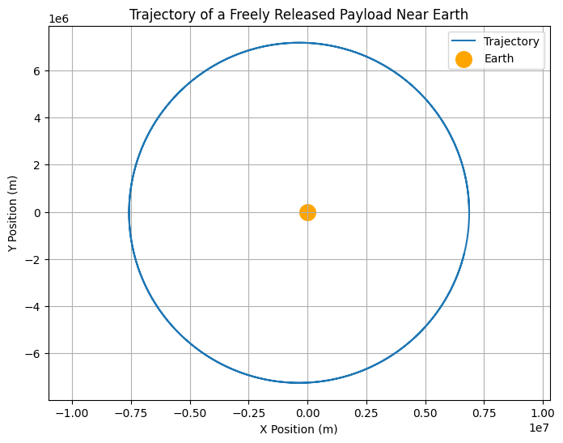

# Problem 3
### Trajectories of a Freely Released Payload Near Earth

When a payload is released from a moving rocket near Earth, its trajectory is heavily influenced by its initial conditions, such as position, velocity, and altitude, as well as the gravitational forces exerted by Earth. The trajectory can take different forms based on these factors, including parabolic, elliptical, or hyperbolic paths, depending on the velocity of release and the direction of motion. This scenario is crucial for space mission planning, such as payload deployment, orbital insertion, or re-entry.

### 1. **Understanding the Gravitational Forces and Trajectories**

The gravitational force near Earth is described by **Newton’s Law of Gravitation**:

\[
F = \frac{GMm}{r^2}
\]

Where:
- \( F \) is the gravitational force,
- \( G \) is the gravitational constant (\( 6.67430 \times 10^{-11} \, \text{Nm}^2/\text{kg}^2 \)),
- \( M \) is the mass of Earth (\( 5.972 \times 10^{24} \, \text{kg} \)),
- \( m \) is the mass of the payload,
- \( r \) is the distance from the center of Earth to the payload.

Using this force, we can analyze the motion of the payload using the equations of motion derived from Newton’s second law of motion. The motion of the payload can then be classified into different types of trajectories based on the initial velocity and position:

- **Elliptical Trajectory**: If the velocity is below the escape velocity but sufficient for the object to orbit Earth, the object follows an elliptical orbit.
- **Parabolic Trajectory**: If the velocity is exactly at the escape velocity, the trajectory will be parabolic, meaning the object will just escape Earth’s gravitational influence.
- **Hyperbolic Trajectory**: If the velocity exceeds the escape velocity, the object will follow a hyperbolic trajectory and escape Earth’s gravity entirely.

### 2. **Numerical Simulation of Payload Trajectories**

To simulate and visualize the trajectories of a payload, we can use numerical methods like the **Euler method** or **Runge-Kutta methods** to solve the equations of motion for the payload under the influence of Earth’s gravity.

#### Equations of Motion:

The payload’s acceleration due to gravity is given by:

\[
\vec{a} = -\frac{GM}{r^2} \hat{r}
\]

Where:
- \( \vec{a} \) is the acceleration vector of the payload,
- \( \hat{r} \) is the unit vector pointing from the payload to the center of the Earth,
- \( r \) is the distance from the center of the Earth to the payload.

Given the initial position and velocity, we can numerically integrate these equations to track the payload’s position over time.

#### Python Implementation:

### 3. **Analysis of Results**

- **Parabolic Trajectory**: If the initial velocity is exactly equal to the escape velocity (approximately \( 11.2 \, \text{km/s} \) near Earth’s surface), the trajectory will be parabolic, and the payload will eventually escape Earth’s gravitational pull.
- **Elliptical and Circular Orbits**: If the velocity is less than the escape velocity but greater than the orbital velocity (approximately \( 7.8 \, \text{km/s} \) for a low Earth orbit), the trajectory will be elliptical. For a circular orbit, the object’s velocity must be exactly matched to the orbital velocity for the given altitude.
- **Hyperbolic Trajectory**: If the initial velocity is greater than the escape velocity, the payload will follow a hyperbolic trajectory, escaping Earth’s gravitational influence completely.

### 4. **Practical Applications**

This analysis has various practical applications in space mission planning:
- **Payload Deployment**: For satellite deployment, the release velocity must be carefully chosen to ensure that the payload remains in a stable orbit or achieves the desired trajectory (e.g., geostationary orbit).
- **Re-entry and Escape**: Understanding the escape velocity and the trajectory of re-entry is crucial for designing spacecraft that can safely return to Earth.
- **Interplanetary Missions**: For missions to other planets, such as Mars or beyond, the release trajectory must be designed to achieve escape velocity from Earth and be directed toward the target planet.

### 5. **Deliverables**

- **Markdown Document**: This document explains the principles behind the problem and the equations used to simulate the payload's motion.
- **Python Code**: The script simulates and visualizes the payload's trajectory near Earth under various initial conditions.
- **Graphical Representation**: The trajectory plot shows the path of the payload, and the final position and velocity are printed after the simulation.
- **Discussion**: The analysis links different types of trajectories (elliptical, parabolic, hyperbolic) to real-world applications like satellite launches and space exploration.

This approach allows space mission planners to predict and optimize the motion of payloads in near-Earth space, ensuring successful mission outcomes.
