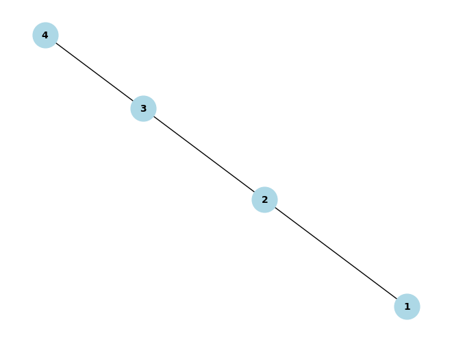

# Problem 1
### Option 1: Simplified Task – Algorithm Description

To calculate the **equivalent resistance** using graph theory, the key idea is to represent the electrical circuit as a **graph**, where:
- **Nodes (vertices)** represent junctions in the circuit (connection points between components).
- **Edges** represent resistors, with weights corresponding to their resistance values.

The goal is to simplify the graph by **iteratively reducing series and parallel connections** until the graph is reduced to a single node with the equivalent resistance as the weight of the edge.

Here's an outline of the algorithm and pseudocode for calculating the equivalent resistance:

---

### **Algorithm for Calculating Equivalent Resistance Using Graph Theory**

#### **Key Steps in the Algorithm:**
1. **Input the Circuit Graph:** The graph consists of nodes (junctions) and weighted edges (resistors).
2. **Identify and Simplify Series and Parallel Connections:**
   - **Series Connection:** Resistors in series can be reduced by summing their resistances.
   - **Parallel Connection:** Resistors in parallel can be reduced by the formula:
     $$
     \frac{1}{R_{eq}} = \sum_{i=1}^{n} \frac{1}{R_i}
     $$
   where \(R_i\) are the resistances of the resistors in parallel.
3. **Iterate:** Keep identifying series and parallel combinations and reduce them until only one equivalent resistance remains.
4. **Return the Equivalent Resistance:** The final graph will have one node, with the edge representing the total equivalent resistance.

---

### **Pseudocode**

```plaintext
Input: Graph G (with nodes and weighted edges representing resistors)

While G has more than one node:
    1. Identify all series connections:
        - A series connection occurs when two resistors are connected end-to-end without any branching. 
        - Combine these resistors by summing their resistances.
        - Update the graph by removing the two nodes (resistors) and adding a new node with the summed resistance.
    
    2. Identify all parallel connections:
        - A parallel connection occurs when two resistors are connected between the same two nodes.
        - Combine these resistors using the parallel resistance formula:
          \[
          R_{eq} = \left( \sum_{i=1}^{n} \frac{1}{R_i} \right)^{-1}
          \]
        - Replace the two parallel resistors with a single edge having the equivalent resistance.
    
    3. Repeat until only one node remains in the graph.

Return the equivalent resistance value of the final node in the graph.
```

### **Explanation of Algorithm:**

- **Series Connections:** When two resistors are in series, the equivalent resistance is simply the sum of their individual resistances. In the graph, this corresponds to two nodes being connected sequentially, and we merge them into a single node, summing the resistances of the two edges.
  
- **Parallel Connections:** When two resistors are in parallel, the equivalent resistance is found by using the parallel resistance formula. In the graph, this corresponds to two edges between the same pair of nodes, and we replace these two edges with a single edge whose resistance is the equivalent of the parallel combination.

- **Iterative Simplification:** The algorithm repeatedly simplifies the graph by finding and reducing series and parallel connections until only one node remains, representing the equivalent resistance.

### **Handling Nested Combinations:**

The algorithm is designed to handle **nested combinations** of resistors, meaning that it works on more complex configurations where resistors are connected in series and parallel in multiple levels. The graph representation makes it easy to apply the same set of rules (series and parallel reductions) to the entire network, regardless of how deep the nested configurations are.

- The iterative approach ensures that every reduction step simplifies the circuit, even when resistors are part of more complicated arrangements.
- If the graph contains cycles, the algorithm should still handle them appropriately by reducing the series and parallel connections within those cycles, but the graph may need to be traversed multiple times to identify all possible reductions.

---

### **Option 2: Advanced Task – Full Implementation**

For a more advanced implementation, you would follow these general steps:

1. **Graph Representation:**
   - Use a graph library like **NetworkX** in Python to represent the circuit.
   - Each node will represent a junction, and each edge will represent a resistor with an associated resistance value.

2. **Identifying Series and Parallel Connections:**
   - Traverse the graph using methods like **Depth-First Search (DFS)** or **Breadth-First Search (BFS)** to detect series and parallel connections.
   - Implement helper functions to check if two resistors are in series or parallel, based on the current configuration of nodes and edges.

3. **Reductions:**
   - **Series Reduction:** If two resistors are in series, merge them into a single resistor.
   - **Parallel Reduction:** If two resistors are in parallel, replace them with a single resistor computed using the parallel resistance formula.

4. **Output:**
   - Once the graph is reduced to a single node, return the total resistance as the equivalent resistance of the circuit.

#### **Python Implementation Using NetworkX (Sketch)**

6. Graph Drawing and Visualization
It’s often useful to visualize your circuit graphically to better understand the structure of your circuit. This can be done with Matplotlib and NetworkX.

Visualizing the Graph:


### **Efficiency Analysis:**

- **Time Complexity:** The complexity of the algorithm depends on how efficiently we can identify and simplify series and parallel connections. The main time-consuming steps are the graph traversals (DFS/BFS) and edge updates, which can be done in \( O(E) \) time per traversal. Hence, in the worst case, the time complexity could be \( O(E \cdot V) \), where \( V \) is the number of nodes and \( E \) is the number of edges.

- **Space Complexity:** The space complexity is \( O(V + E) \), since the graph is stored in memory and we need to maintain the nodes and edges during the simplification process.

---

By using this approach, we can efficiently calculate the equivalent resistance of even complex circuits by iteratively reducing the graph, leveraging graph theory's powerful methods for solving electrical circuit problems.