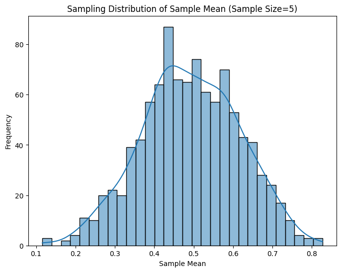
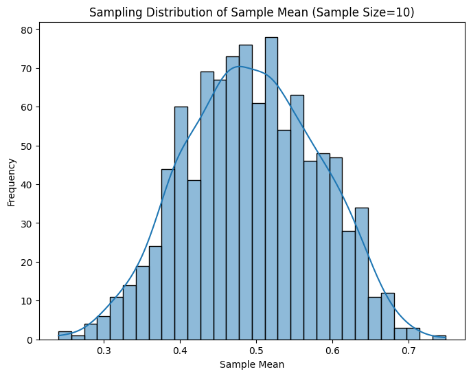

# Problem 1
This task provides a great opportunity to learn about the Central Limit Theorem (CLT) through simulations, and I'll guide you through the process of creating simulations and visualizations in Python. The key is to explore how different population distributions (uniform, exponential, and binomial) behave when we take random samples, calculate the sample mean, and observe how these sample means converge to a normal distribution as the sample size increases.

### Task Breakdown and Python Implementation

#### 1. **Simulating Sampling Distributions**

We'll start by defining different population distributions: Uniform, Exponential, and Binomial.

- **Uniform distribution:** A distribution where all outcomes are equally likely within a given range.
- **Exponential distribution:** A distribution commonly used to model the time between events in a Poisson process.
- **Binomial distribution:** A discrete distribution that models the number of successes in a fixed number of independent trials, each with the same probability of success.

We’ll generate a large dataset from each of these distributions to represent the population.

#### 2. **Sampling and Visualization**

Once we have the populations, we will:
- Randomly sample from the population.
- Calculate the sample mean for different sample sizes.
- Repeat the sampling process multiple times to build a sampling distribution of the sample mean.
- Visualize this distribution using histograms and observe how the distribution of sample means converges to normality.

#### 3. **Parameter Exploration**

We will vary the sample size and investigate the effect on the convergence rate:
- How does increasing the sample size influence the distribution of sample means?
- How does the population variance affect the spread of the sample means?

#### 4. **Practical Applications**

The CLT is foundational for statistical inference, and we’ll discuss its practical implications:
- How it helps estimate population parameters (e.g., mean, variance) from samples.
- How the CLT is used in quality control and predicting financial outcomes.

---

### **Python Code Implementation**

Let’s implement this step by step using Python and libraries such as `numpy`, `matplotlib`, and `seaborn`.


We'll generate large datasets for each of the distributions.

```python
# Set random seed for reproducibility
np.random.seed(42)

# Population sizes
population_size = 10000

# Population distributions
uniform_population = np.random.uniform(low=0, high=1, size=population_size)
exponential_population = np.random.exponential(scale=1, size=population_size)
binomial_population = np.random.binomial(n=10, p=0.5, size=population_size)
```

Now we will define a function to sample from these populations, compute the sample means, and repeat the process multiple times.


#### Step 4: Visualizing the Sampling Distributions

For each population distribution, we will take samples of different sizes (e.g., 5, 10, 30, 50) and plot the histograms of the sample means.




# Define sample sizes to explore
sample_sizes = [5, 10, 30, 50]

# Plot for each population
print("Uniform Distribution")
plot_sampling_distribution(uniform_population, sample_sizes)

print("Exponential Distribution")
plot_sampling_distribution(exponential_population, sample_sizes)

print("Binomial Distribution")
plot_sampling_distribution(binomial_population, sample_sizes)
```

#### Step 5: Analysis and Discussion

- **Sample Mean Convergence:** As you increase the sample size, the distribution of sample means will gradually approach a normal distribution, as predicted by the Central Limit Theorem.
- **Impact of Population Distribution:** Notice how even for a non-normal population (e.g., Exponential or Binomial), the sample means converge to a normal distribution as the sample size grows.
- **Variance Impact:** Populations with larger variances will have wider sampling distributions of the sample mean, while those with smaller variances will have tighter distributions.

#### Step 6: Reflection on Practical Applications

- **Estimating Population Parameters:** The CLT helps us estimate population means even when we don’t know the entire population distribution. We can take samples and use the sample mean as an unbiased estimator.
- **Quality Control:** In manufacturing, the CLT allows for sampling to monitor product quality. Even if the product quality distribution is skewed, the sample mean will be normally distributed for large enough sample sizes, making it easier to detect issues.
- **Financial Modeling:** The CLT is used in finance for risk management and portfolio optimization. It allows analysts to make predictions about returns based on sampling from historical data.

### **Deliverables**

1. **Markdown Document**: A document summarizing the experiment, including:
   - A description of the Central Limit Theorem.
   - Code snippets with explanations.
   - Insights based on the simulations (convergence to normality, effect of sample size, etc.).
   - Discussion of practical applications in statistics.

2. **Python Script/Notebook**: The code used for the simulations and visualizations.

3. **Plots**: The histograms showing the sampling distributions for different sample sizes.

---

### Conclusion

By running the above simulations and visualizing the results, you will gain a deeper understanding of how the Central Limit Theorem works and how it can be applied to real-world scenarios. This experiment will show you how even non-normal populations yield normal-like distributions for the sample mean when sample sizes are large enough.
