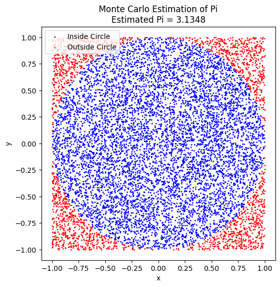
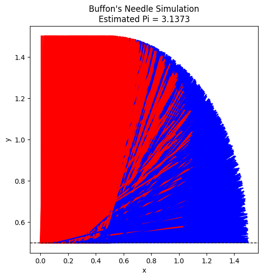

# Problem 2
This task offers a great opportunity to explore two fascinating methods for estimating the value of Pi (π) using Monte Carlo simulations: the **Circle-based Method** and **Buffon's Needle**. We'll go step-by-step, covering the theory, simulation, visualization, and analysis for each method.

### **Part 1: Estimating Pi Using a Circle (Monte Carlo Method)**

#### **1. Theoretical Foundation:**

We can estimate π by considering a circle inscribed within a square. Here's how we can use geometric probability to estimate π:

- Consider a **unit circle** (radius = 1) inscribed inside a **unit square** (side length = 2). The area of the square is 4 (2 * 2), and the area of the circle is π (π * r², with r = 1).
- The ratio of the area of the circle to the area of the square is:

\[
\frac{\text{Area of Circle}}{\text{Area of Square}} = \frac{\pi}{4}
\]

- If we randomly throw points inside the square, the fraction of points that fall inside the circle should be approximately equal to the ratio of the areas:

\[
\frac{\text{Points Inside Circle}}{\text{Total Points}} \approx \frac{\pi}{4}
\]

Thus, we can estimate π as:

\[
\pi \approx 4 \times \frac{\text{Points Inside Circle}}{\text{Total Points}}
\]

#### **2. Simulation:**

We'll simulate the random generation of points inside a square and count how many fall inside the unit circle. To determine if a point is inside the circle, we use the equation of the circle:

\[
x^2 + y^2 \leq 1
\]

#### **3. Visualization:**

We’ll create a plot showing the points inside and outside the circle to visualize the process.

#### **4. Python Implementation:**

#### **Analysis:**
- As the number of points increases, the estimate of π should converge to the true value.
- You can explore how accuracy improves by running simulations with increasing numbers of points (e.g., 100, 1,000, 10,000, etc.).
  
#### **Plot Output:**
The plot will show randomly generated points, with blue points inside the circle and red points outside the circle. The accuracy of the Pi estimate will improve as more points are added.

---

### **Part 2: Estimating Pi Using Buffon’s Needle**

#### **1. Theoretical Foundation:**

Buffon's Needle problem involves a needle of length \( L \) dropped on a floor with parallel lines spaced \( d \) units apart. The probability \( P \) that the needle crosses a line is related to π by the formula:

\[
P = \frac{2L}{\pi d}
\]

For this simulation, we typically use a needle with \( L = d \), simplifying the formula to:

\[
P = \frac{2}{\pi}
\]

From this, we can estimate π by counting the number of times the needle crosses a line and using the formula:

\[
\pi \approx \frac{2 \times \text{Number of Drops}}{\text{Number of Crosses}}
\]

#### **2. Simulation:**

To simulate the dropping of a needle, we:
- Randomly choose the angle the needle makes with the parallel lines.
- Randomly choose the distance from the center of the needle to the nearest line.
- Check if the needle crosses a line based on these values.

#### **3. Visualization:**

We will create a plot showing the positions of the needles, indicating whether they cross the lines.

#### **4. Python Implementation:**

#### **Analysis:**
- Similar to the circle-based method, the accuracy improves with more needle drops.
- Compare the convergence rates of both methods by plotting the estimated values of π as a function of the number of iterations (number of points for the circle-based method and number of drops for Buffon's Needle).

#### **Plot Output:**
The plot will show the randomly dropped needles, with red needles crossing the lines and blue ones not crossing the lines. The estimate of π will improve as more drops are simulated.

---

### **Comparison of Methods**

#### **Convergence Analysis:**
- **Circle-based Method:** This method converges more smoothly to π, as the estimate improves steadily with the number of points. It tends to be computationally efficient and works well with large sample sizes.
- **Buffon’s Needle Method:** This method converges more slowly and is typically less efficient for estimating π compared to the circle-based approach. However, it's a more interesting physical simulation of probability.

#### **Computational Efficiency:**
- The **circle-based method** involves random point generation, which can be very fast, especially with efficient random number generation algorithms.
- **Buffon’s Needle** involves more complex geometric calculations per drop, so it may take more computation for a similar level of accuracy.

---

### **Deliverables**
1. **Markdown Document**:
   - Explanation of both methods and the derivation of formulas.
   - A comparison of the convergence rates and computational efficiency of both methods.
2. **Python Scripts**:
   - Code for the circle-based method.
   - Code for Buffon's Needle method.
3. **Graphical Outputs**:
   - Visualizations of the random points for the circle method.
   - Visualizations of the needle positions for Buffon's Needle.
4. **Analysis**:
   - Graphs or tables showing the convergence of π estimates as the number of iterations increases.

By following this process, you'll be able to estimate π using Monte Carlo simulations and gain insights into both methods.